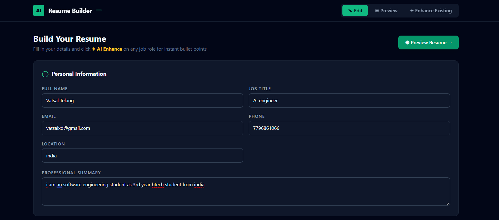
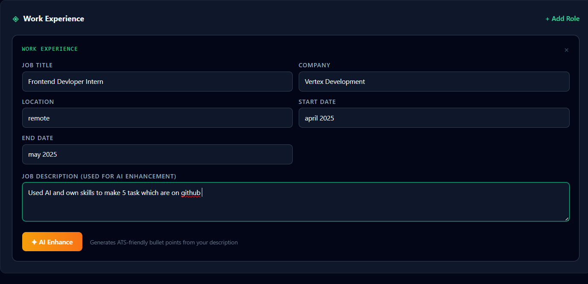
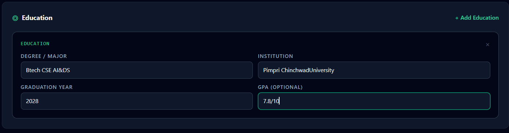
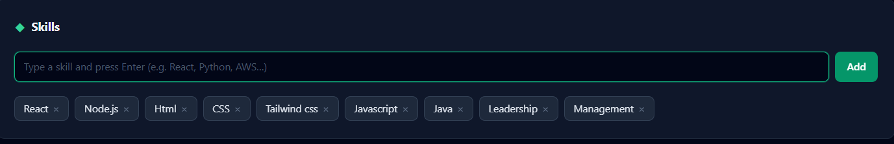
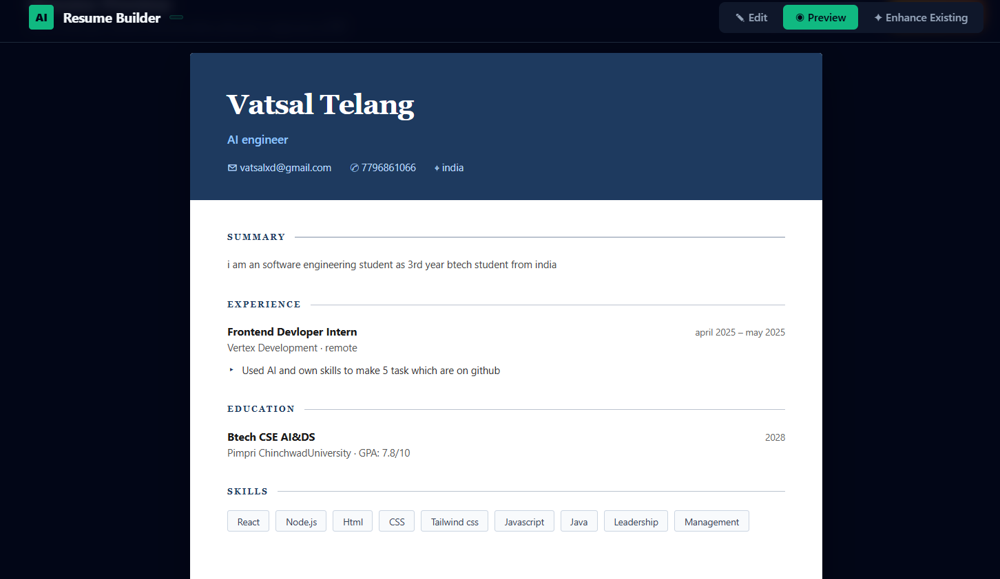
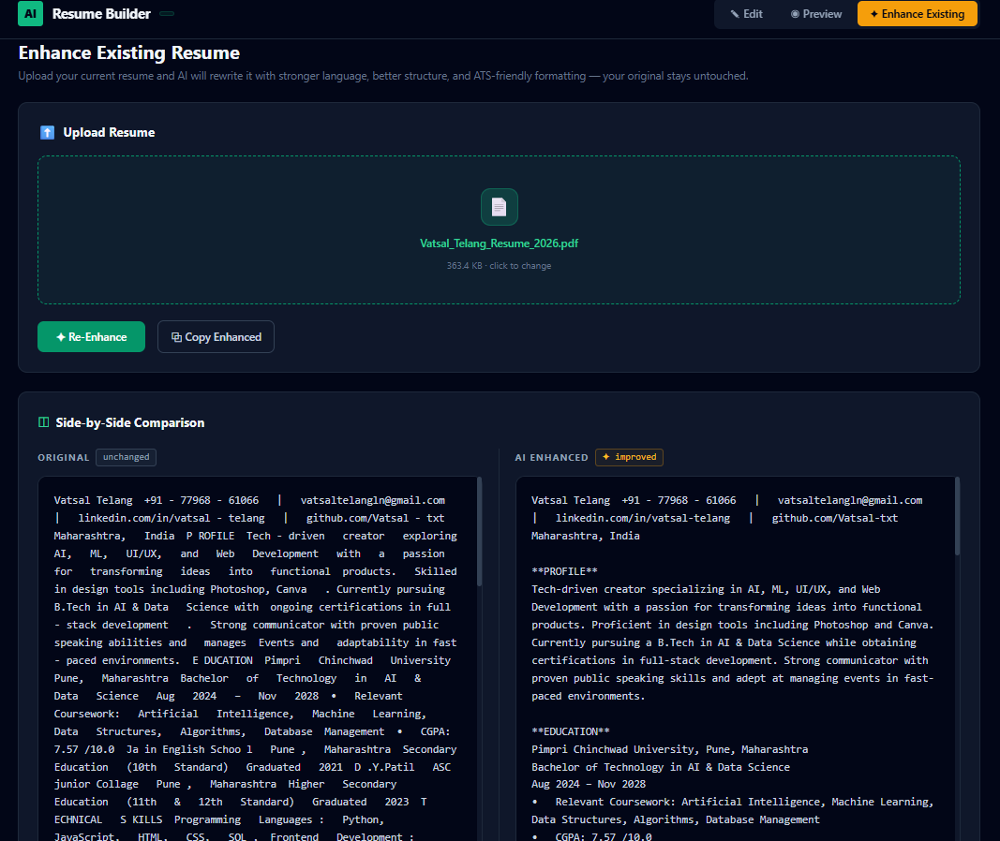

# 🧠 AI Resume Builder

AI Resume Builder is an AI-powered resume creation and enhancement platform that helps students, job seekers, and professionals build polished, ATS-friendly resumes in minutes.


- ✎ Resume Builder with live form editing
- ✦ AI-powered bullet point generation per job role
- ◉ Real-time Resume Preview
- ✦ Upload & Enhance Existing Resume (side-by-side comparison)

---

## 🌟 Features

### ✎ Resume Builder
Fill in your details across structured sections:
- Personal Information (Name, Title, Email, Phone, Location, Summary)
- Work Experience with AI Enhance per role
- Education
- Skills

### ✦ AI Enhance (Per Job Role)
For each work experience entry:
- Paste your job description
- Click **✦ AI Enhance**
- Instantly get 4–5 ATS-friendly bullet points powered by GPT-4o-mini
- Edit or remove any bullet before previewing

### ◉ Resume Preview
A clean, print-ready resume preview showing:
- Header with contact info
- Summary, Experience, Education, Skills sections

### ✦ Enhance Existing Resume
Upload your old resume (`.pdf` or `.txt`) and:
- AI rewrites it with stronger language and better structure
- View **Original vs AI Enhanced** side-by-side
- Copy the enhanced version with one click
- Your original is never modified

---

## 📸 Screenshots

### ✎ Edit — Personal Info


### ◈ Work Experience with AI Enhance


### ◎ Education & ◆ Skills



### ◉ Resume Preview


### ✦ Enhance Existing Resume


---

## 🏗️ Project Architecture

```text
User Input / Uploaded Resume
        │
        ▼
  Frontend (React + Tailwind CSS)
        │
        ▼
  Backend (Node.js + Express)
        │
        ▼
  OpenRouter API (GPT-4o-mini)
        │
        ▼
  ATS-Friendly Resume Output
```

---

## 🛠️ Tech Stack

### Frontend
- React.js
- Tailwind CSS
- PDF.js (for PDF text extraction)

### Backend
- Node.js
- Express.js

### AI
- OpenRouter API 

### Utilities
- dotenv
- cors

---

## 📂 Project Structure

```text
ai-resume-builder/
│
├── frontend/
│   ├── public/
│   │   └── index.html
│   ├── src/
│   │   ├── components/
│   │   │   ├── AIButton.js
│   │   │   ├── ResumeForm.js
│   │   │   ├── ResumePreview.js
│   │   │   └── ResumeUploadEnhancer.js
│   │   ├── styles/
│   │   │   └── tailwind.css
│   │   ├── App.js
│   │   └── index.js
│   ├── tailwind.config.js
│   └── package.json
│
├── backend/
│   ├── server.js
│   ├── .env
│   └── package.json
│
└── README.md
```

---

## ⚙️ Installation

### 1. Clone Repository

```bash
git clone https://github.com/YOUR_USERNAME/ai-resume-builder.git
cd ai-resume-builder
```

### 2. Setup Backend

```bash
cd backend
npm install
```

Create a `.env` file inside `/backend`:

```bash
npm start
```

### 3. Setup Frontend

```bash
cd frontend
npm install
npm start
```

Frontend runs at `http://localhost:3000`
Backend runs at `http://localhost:5000`

---

## 🔮 Future Enhancements

- PDF Export of built resume
- User Authentication & resume history
- Multiple resume templates
- Job description matching score
- LinkedIn profile import
- Cloud deployment (Vercel + Railway)

---

## 🎯 Use Cases

- Students applying for internships
- Fresh graduates building their first resume
- Professionals updating an old resume
- Anyone wanting ATS-optimized bullet points instantly

---

## 👨‍💻 Author

**Vatsal Telang**

GitHub: https://github.com/Vatsal-txt

LinkedIn: www.linkedin.com/in/vatsal-telang/

---

## 📄 License

This project is licensed under the MIT License.

---

## ⭐ Support

If you found this project useful, consider giving it a ⭐ on GitHub!
